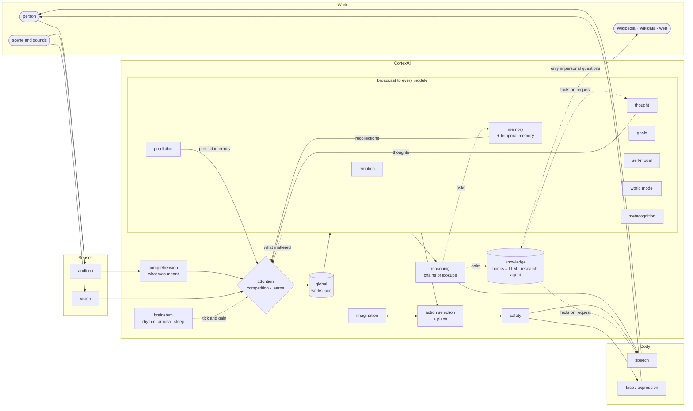
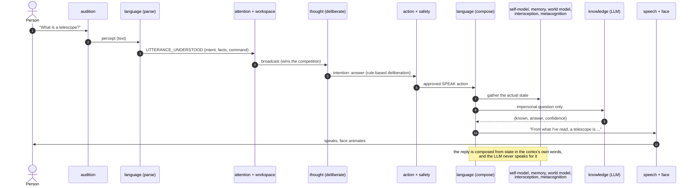
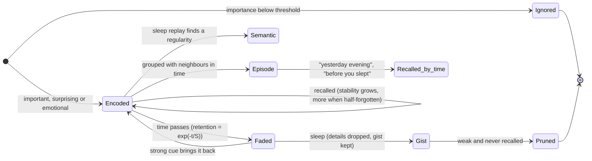

# CortexAI: Architecture

> An experimental, brain-inspired cognitive architecture. It does **not** claim to be conscious.
> Consciousness is treated as an open scientific question; the system implements *measurable
> functional properties* (global broadcasting, persistent self-model, temporal continuity,
> self/world distinction, prediction, internal simulation, metacognitive reports) so that they
> can be studied, ablated and compared.

## 1. Design principles

1. **The language model is not the brain.** It has exactly two jobs, and both return data, never
   speech: *book knowledge* (the `knowledge` module: impersonal questions, answered as
   known / answer / confidence, with a **research agent** that looks things up online — Wikidata for
   who holds an office, Wikipedia, Tavily with a key — and answers only from what it fetched) and
   *translation* (the `comprehension` module: turning an utterance the rules could not place into a
   fixed structure — what is wanted, of what kind, about what). Thought, deliberation, speech, the
   self-narrative, dreams and memory consolidation belong to the cortex's own modules, and without a
   model the rule layer stands on its own.
2. **No all-to-all coupling.** Modules talk only through a single thalamic bus:
   publish/subscribe for events, request/response for queries, nomination for attention.
   No module imports another.
3. **Reproducible by design.** A virtual clock with manual stepping and quiescence detection, a
   fixed seed, and a deterministic symbolic language layer make experiments repeatable.
4. **Graceful degradation.** Every model call has a symbolic fallback and a timeout; a model
   failure never stops cognition.
5. **Reports are not states.** Verbal reports about internal state are separate events that no
   module consumes, so talking about a state can never change it.

## 2. Conceptual loop



The **brainstem** sets the rhythm: each `TICK` is one cognitive cycle (attention → workspace →
consumers). The cycle speeds up with arousal, from slow when drowsy to fast when highly alert.
Urgent stimuli trigger an immediate "phasic" tick.

## 3. Components

| Module | Brain inspiration | Kind | Responsibilities |
|---|---|---|---|
| `brainstem` | Reticular activating system, hypothalamus | deterministic | arousal, energy, fatigue, sleep pressure, stress, urgency, novelty; modes AWAKE/DROWSY/ASLEEP/DREAMING; tick rhythm; thalamic sensory gain; interoceptive signals |
| bus | Thalamus | deterministic | routing, provenance (`caused_by`), timestamps, sensory gating, request/response, event log, quiescence tracking |
| `attention` | Salience network, pulvinar | algorithm + plasticity | competition over salience, novelty, urgency, goal relevance, emotional relevance, uncertainty and prediction error; weights modulated by curiosity/fear; an arousal-, energy- and mode-dependent ignition threshold; **learned weights**: components that spoke for something that mattered (remembered, acted on, thought about) are strengthened, those that led nowhere are weakened, bounded and kept across restarts |
| `workspace` | Global neuronal workspace | deterministic | capacity-limited (4) broadcast contents with decay and displacement; a local relay replaces it in ablations |
| `working_memory` | Prefrontal / phonological loop | deterministic | 7 slots, exponential decay, rehearsal, eviction by activation × importance; dialog buffer; unresolved questions |
| `memory` | Hippocampus + cortex | embeddings + database | episodic, semantic, procedural, autobiographical, dream and imagined memories; importance-gated encoding; cue-driven and explicit recall (relevance × retention × importance × strength); temporal memory (see §7) |
| `emotion` | Limbic valuation | deterministic | pleasure, discomfort, curiosity, fear, urgency, social, novelty, frustration, satisfaction, boredom; appraisal + homeostatic decay; causally modulates attention, encoding, arousal and action |
| `goals` | vmPFC / motivational systems | deterministic | persistent intrinsic goals + situational goals (respond, explore surprises); dynamic priorities (rest ∝ fatigue) |
| `thought` | Inner speech / dlPFC | symbolic | bounded thought chains, loop detection, interruption, rate limits, mind-wandering when idle (which may bring back something it has read); think-before-speaking deliberation |
| `comprehension` | Wernicke (language understanding) | rules + language model as translator | turns what the rules could not place into a structured request (perform / act / ask / social), maps it to a capability or admits there is none, and holds **learned skills**: what the person teaches ("when I say hop, close your eyes") is matched by wording and by meaning, kept in procedural memory and across restarts |
| `language` | Wernicke / Broca | parser + composer | structured understanding (intents, facts, commands, multi-step requests); replies composed from the cortex's actual state in its own words; general-knowledge answers woven in ("From what I've read, ..."); verbal reports logged beside their state snapshots |
| `knowledge` | Semantic cortex fed by reading | language model + research agent | answers impersonal questions as data; refuses anything about itself, the speaker, the moment or its location before any model or network call; discards answers where a persona leaks in; for unknown or time-sensitive questions (and only with the `internet_read` permission) delegates to a bounded research agent that asks Wikidata for office holders (current or in a given year, with dates) and searches Wikipedia and Tavily, answers only from fetched notes with citations, and falls back to a fixed pipeline; remembers what it read or looked up as semantic memory with source and date |
| `speech` | Motor speech | effector | executes approved speech; safety text filter; optional synthesised voice; efference copy |
| `expression` | Facial motor system | effector | timed facial expressions (smile, laugh, wink, closed eyes, looking left/right/up/down, ...) on top of the emotion-driven baseline; facial feedback into valuation |
| `action` | Basal ganglia | algorithm | candidate generation, utility (base + goals + emotion + habits − energy cost), imagination-backed evaluation, one action per channel (vocal / other), deliberate silence, habit learning, committed multi-step plans ("close your eyes, count to 10, then open them": steps run in order, each through safety, each waiting to be seen or heard) |
| `safety` | Inhibitory control | policy | allow-list, capability check, permissions for external actions, rate limits, no external action during sleep |
| `prediction` | Predictive coding | algorithm | visual scene persistence, conversational expectations (including *missing* replies), speaker tone, action outcomes, own arousal; errors drive attention, curiosity, memory and exploration |
| `imagination` | Default mode / hippocampal simulation | rules | outcome/value/risk of actions without acting; dream recombination; deliberate imagining |
| `sleep` | NREM/REM processes | orchestrator | replay → cluster → abstract → strengthen → fade old episodes to gist → prune; self-narrative rewrite; dream-like simulations while external input is gated |
| `self_model` | Self-referential cortex | deterministic | identity, body (an animated face: eyes, eyebrows, mouth; no limbs), sensors, capabilities, static + learned limitations, current state, activity timeline, temporal continuity, predicted future, attributed perception ("I perceived via my camera ...") |
| `world_model` | Posterior cortex / cognitive map | deterministic | entities with beliefs (value, confidence, source, time, decay); object permanence with growing uncertainty; conflict detection |
| `reasoning` | Prefrontal reasoning / working it out | rules over its own sources | recognises the *shape* of a question and plans a short chain of lookups across memory, the self-model, the clock, its books and the web: multi-hop ("who is the president of the country where X is"), comparison ("which is taller, X or Y" — both figures quoted), time arithmetic ("how many days until X"), and self-explanation ("why did you do that", walked from the real provenance of its own events); reports the chain it followed and says which step failed rather than filling the gap |
| `metacognition` | Anterior PFC | deterministic | confidence, knowledge gaps, memory/perception conflicts, source monitoring, model reliability, current focus, all from real metadata |
| `vision` | Visual cortex | object detection (+ optional scene description) | change detection, detection, spatial relations, structured percepts (no raw pixels leave the module) |
| `audition` | Auditory cortex | signal processing + speech recognition | silence / sound / speech classification, speech recognition, loud-sound startle; text channel as a sensory interface |

All model outputs carry confidence and provenance and are never stored as bare facts.

### How a sentence becomes a reply



## 4. Event model

Every message is a typed `Event`:

```
id, type, source, timestamp, cycle, payload (validated per type),
summary, modality, confidence, salience, importance, urgency, emotional_value,
uncertainty, gain (thalamic gating), caused_by (provenance), nominated (attention candidate)
```

Types include PERCEPTION, UTTERANCE_UNDERSTOOD, ATTENTION_CHANGED, WORKSPACE_UPDATED,
MEMORY_RETRIEVED/STORED/REPLAYED/CONSOLIDATED, THOUGHT_GENERATED, GOAL_CREATED/UPDATED,
EMOTION_CHANGED, PREDICTION_MADE/ERROR, SIMULATION_RESULT, ACTION_PROPOSED/SELECTED/APPROVED/
REJECTED/EXECUTED, SPEECH_GENERATED, VERBAL_REPORT, SLEEP_STARTED/ENDED, DREAM_STARTED/ENDED/
CONTENT, SELF_STATE_CHANGED, WORLD_UPDATED/CONFLICT, METACOGNITIVE_REPORT, SYSTEM_BOOT/SHUTDOWN,
MODULE_ERROR, COMMAND. A payload that does not match its type is rejected.

**Communication primitives**: `emit/publish` (events), `nominate` (attention candidates),
`request(topic)` (e.g. `memory.recall`, `self.describe`, `world.describe`, `knowledge.query`),
`broadcast` (workspace contents). Capabilities are discovered from `executor.<action>`
responders, so ablating a module removes its capabilities and the rest of the cortex adapts.

## 5. Internal state vs. verbal claims

* Internal state: numeric, owned by modules (body state, valuation state, ...).
* Verbal report: produced by `language` from a snapshot of that state and published as
  `VERBAL_REPORT {report, state_snapshot}`. No module subscribes to it and it is never nominated;
  a structural test enforces this.
* Experiments score **report/state agreement** (e.g. the reported arousal vs. the actual value).

## 6. Persistence and identity

A durable store keeps the full event log, module transitions (input → outputs, state
before/after, model used, latency, confidence), memories with their embeddings (re-embedded
automatically if the embedder changes), goals, world entities and lifecycle data (identity,
creation time, boot count, last shutdown, uptime, body and valuation state, self-narrative,
learned limitations, habits).

After a restart the cortex knows its boot count, how long it was offline (the boot is attended
and remembered), its memories, its goals and its learned limits. Situational goals are marked
abandoned on restart. Nothing is stored as one giant prompt.

## 7. Temporal memory

Memories live in time the way human memories do. Each part can be switched off for ablations.



* **Forgetting curve.** Retention falls off exponentially with the time since a memory was last
  used: `R = exp(-t / S)`. The stability `S` grows with importance and emotional intensity, and
  is much larger for knowledge (semantic, procedural, autobiographical) than for episodes. An
  unimportant episode is effectively gone within days; a vivid one lasts much longer.
* **Spacing effect.** Every recall resets the curve and raises the stability, more when the
  memory was already half-forgotten than when it was fresh, so memories that keep coming back
  become durable.
* **Accessibility.** A faded memory is not deleted at once: it simply stops coming back on a
  weak cue, and only a strong, specific cue can still reach it.
* **Gist over detail.** During sleep, faded episodes lose their exact words and keep only their
  gist ("you talked to me about the telescope"). Very important memories keep their details
  (flashbulb memories). Weak, faded, never-recalled episodes are eventually pruned.
* **Episodes.** Experience is segmented into episodes at pauses, at sleep and at big surprises.
  Each episode keeps who was there, what it was about (the nouns of what was said, not the
  questions asked about it) and what was done, and is summarised in the cortex's own words.
* **Recall by time.** Questions such as "what did we talk about yesterday evening?", "two hours
  ago", "before you fell asleep" or "when we first met" are answered from the episodes, with
  human time labels ("this morning", "yesterday evening", "on Monday"). When nothing is found,
  it says so rather than guessing.

## 8. Plasticity

What experience changes, and what it does not:

* **Attention weights** move towards what turned out to matter. Shortly after an item wins the
  workspace, the cortex checks whether anything came of it (a memory encoded, an action selected, a
  thought, a prediction error); the components that spoke for it are strengthened or weakened, within
  bounds, and persisted.
* **Skills.** A wording the person explains ("when I say hop, close your eyes") becomes a learned
  skill, stored as procedural memory, matched later by wording or meaning, and kept across restarts.
* **Habits.** Action selection keeps a success rate per action and prefers what has worked.
* **Memory.** Retrieval strengthens a trace and slows its forgetting (the spacing effect); sleep
  turns repeated episodes into semantic knowledge.
* **Limitations.** Blocked actions become learned limitations in the self-model.

Not learned: the module structure, the safety policy and the permissions. Each of these can be
switched off for ablations (`[attention] learn`, ablating `comprehension`).

## 9. Time

A real clock (optionally scaled) or a virtual clock (advances per tick; used for experiments).
The temporal state tracks boot time, elapsed time, downtime, episodes (a new episode after sleep
or a long silence) and sleep cycles. The self-model keeps an activity timeline ("five minutes
ago I was talking with Ada").

## 10. Safety

`cognition → ACTION_SELECTED → safety → ACTION_APPROVED/REJECTED → effectors`. Actions that reach
outside the cortex need explicit permission grants; looking things up online needs `internet_read`
(on in the shipped config, off in the code defaults used by tests), sends only impersonal questions, and
is rate-limited and cached. Speech can give a permission up but never grant one. Credentials are never placed in prompts, and
prompts, logs and memories pass through secret redaction (optional PII redaction). The camera
and microphone are off by default, and raw frames are not stored.

## 11. Observability

A live dashboard shows arousal and body state, attention (components, weights, threshold), the
workspace, the current thought and inner monologue, goals, the valuation state with history,
the self-model, the world model, working memory, long-term memory, metacognition, predictions
and errors, action decisions with alternatives and imagined values, safety rejections,
sleep/dreams, per-module load, and a filterable timeline. Selecting an event shows its
transition records.

### Embodied interface (the face)

The face is an effector/sensor surface, not a module: its eyes stream camera frames to `vision`
(tracking on every frame, publishing percepts only on stable scene changes); its ears send
recognised speech to the auditory channel; its mouth renders speech; its expression follows the
brainstem, the valuation state and requested expressions. Nothing the face displays writes back
into the cortex's state.

## 12. Experiments

**Benchmark** (`python -m organism benchmark`, results in [docs/results.md](docs/results.md)): 12
tasks, each testing one claim (memory, restart, temporal memory, introspection, attention,
prediction, emotion, self-model, perception, action, honesty, sleep), under 9 conditions (full and
8 ablations) with 10 seeds each, plus an LLM-only chatbot baseline. The facts in each protocol are
drawn per seed. Task scores are reported with 95% bootstrap confidence intervals, and ablations
are compared with the full system paired by seed.

**Ablation runner** (`python -m organism experiment`): the original single-protocol experiments below.


Each condition runs on a fresh cortex with the same protocol: introductions → perception →
probes → a simultaneous audio-visual event → distraction → a delay → probes → restart after
time offline → probes.

Conditions: baseline, without long-term memory, without the self-model, without the global
workspace, sensory deprivation, and single-module lesions.

Measured: continuity, identity, introspective accuracy, perception, cross-modal integration,
self-knowledge, self-reference rate, response rate, workspace modality mix, share of decisions
made with multimodal context, and share of imagined decisions. Sensory deprivation measures
internal activity (thoughts, replays, dreams, abstractions) with no input.
