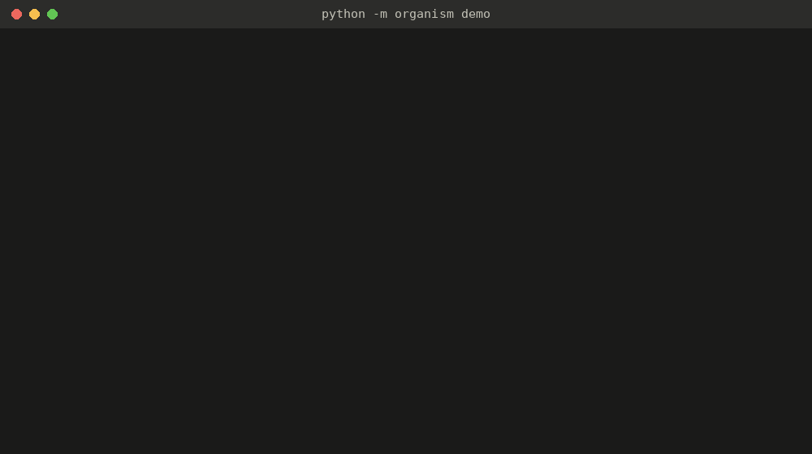
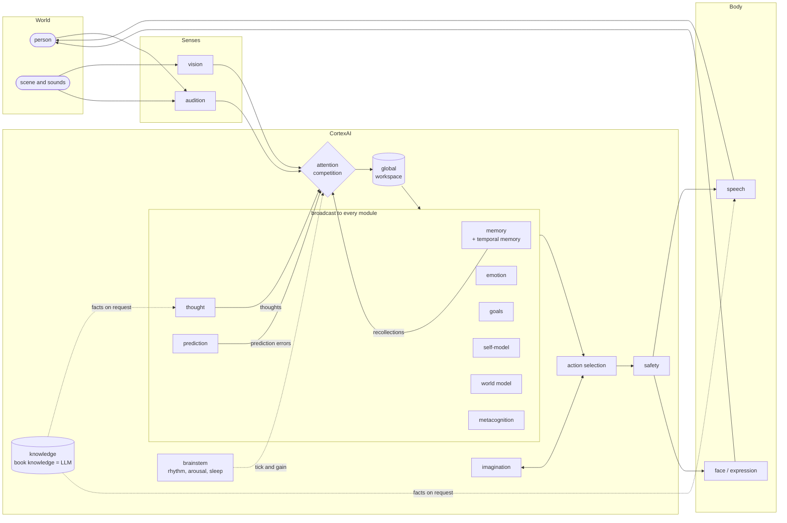

# CortexAI

**A brain-inspired cognitive architecture in which the language model is only its books.**

CortexAI is a persistent artificial individual built from ~20 cooperating modules (brainstem,
thalamic bus, attention, global workspace, working and long-term memory, emotion, goals, thought,
prediction, imagination, sleep, self-model, world model, metacognition, senses and a face). It
thinks, decides, remembers, forgets, sleeps and speaks with its own modules; a local language model
is consulted only for general knowledge, like something it once read. It makes **no claim of
consciousness**: it implements measurable functional properties so they can be tested and ablated.

<p align="center"></p>

## What makes it different

- **The LLM is not the brain.** Thought, deliberation, speech, the self-narrative, dreams and memory
  consolidation are the cortex's own. The language model answers impersonal questions as data
  ("From what I've read, ..."), and is never asked anything about the cortex, the speaker or the moment.
- **A persistent individual.** It survives restarts with its identity, memories, goals and a sense of
  how long it was off. Memory behaves in time like human memory: a forgetting curve, the spacing
  effect, fading to gist during sleep, episodes, and recall by time ("yesterday evening").
- **Embodied.** Its body is an animated face. Requests become real actions of that body, including
  multi-step plans ("close your eyes, count to 5, then open them"), and it knows what it can and
  cannot do.
- **Honest by construction.** Verbal reports are read from the actual internal state and can never
  write to it; it says "I don't know" rather than inventing personal facts.
- **Measurable.** Every claim has a benchmark task, and every module can be ablated.

## Results

`python -m organism benchmark --llm-baseline --publish` runs 12 claim-linked tasks under 9 ablation
conditions (10 seeds each, with the facts drawn per seed) plus an LLM-only chatbot baseline, and
publishes [docs/results.md](docs/results.md).

<picture>
  <source media="(prefers-color-scheme: dark)" srcset="docs/figures/overall-dark.svg">
  
</picture>

Each ablation breaks the capability it is responsible for, and only that (paired by seed; the full
table and heatmap are in [docs/results.md](docs/results.md)):

| removed | what breaks |
|---|---|
| long-term memory | memory after a delay, surviving a restart, recall by time |
| temporal memory | recall by time, fading of unimportant details |
| self-model | knowing who it is, that it has a face, and that it was restarted and for how long |
| global workspace | one introspection probe: its arousal report at rest drifts from the actual value (a small effect) |
| attention | picking the salient stimulus out of a flood |
| prediction | noticing that something changed |
| emotion | emotional moments outlasting neutral ones, mood reports |
| face / expression | acting on requests with its body |

The **LLM-only chatbot** (same local model, chat history, percepts as text) scores **0.53**: it
forgets your name at every restart, claims to remember conversations from times when nothing
happened, says it can move around, and invents facts it was never told ("My sensors show your car
is a bright red!"). Probes it structurally cannot attempt (internal state, a face, sleep) are
excluded, not failed.

## Architecture



Details, the utterance pipeline and the memory lifecycle: [ARCHITECTURE.md](ARCHITECTURE.md).

## Quick start

```bash
pip install -e .[dev]
python -m pytest                        # offline, deterministic

python -m organism demo                 # the scripted tour above (add --pace 1.2 to record it)
python -m organism benchmark            # 9 conditions x 10 seeds x 12 tasks, ~30 s
python -m organism benchmark --llm-baseline --publish   # + chatbot baseline, writes docs/
python -m organism serve                # continuous cortex + dashboard -> http://127.0.0.1:8765
                                        #   face -> /face, live brain map -> /brain
python -m organism chat --thoughts      # terminal conversation, showing inner thoughts
python -m organism status               # persisted identity, memories, event counts
```

General knowledge uses a local Ollama model when available (`qwen3.5:4b` by default); without it the
cortex runs fully symbolic and reproducible (`--llm rule`). Memory uses `nomic-embed-text`
embeddings, falling back to hashing. Everything is configurable in `config/organism.toml` or via
`ORGANISM_<SECTION>__<KEY>` environment variables.

Optional senses: `ORGANISM_VISION__ENABLED=true` (server camera, YOLO), `ORGANISM_AUDIO__MICROPHONE=true`
(needs `pip install sounddevice`), `ORGANISM_SPEECH__TTS=kokoro`. The dashboard can also send
webcam frames, push-to-talk recordings and image uploads, and speak replies with the browser voice.

Ablate modules at runtime: `python -m organism serve --disable memory,self_model`.

## The face (`/face`)

A living particle face (~600 dots in a plexus mesh) wired to the organism:

* **Eyes = vision.** Webcam frames stream to the visual system (YOLO26n on the GPU, ~30-50 ms/frame).
  Pupils follow the person it detects, with browser-side motion tracking for smooth saccades between
  frames. A dotted "optic nerve" carries a pulse per processed frame. Percepts reach cognition only
  when the scene changes stably (hysteresis), and it may greet someone who appears.
* **Mouth = speech.** Every `SPEECH_GENERATED` event is voiced (browser voice, or Kokoro audio with
  amplitude lip-sync) and lip-synced with per-letter visemes; the caption highlights the current word.
* **Ears.** Continuous speech recognition (Chrome/Edge) feeds the auditory channel and pauses while it
  speaks; the ear dots glow with microphone level. Other browsers get push-to-talk (server Whisper).
* **Expression = internal state.** Smile follows valence, brows follow curiosity/fear/frustration, eye
  width follows urgency, pupils dilate with arousal, blinks speed up with fatigue; it closes its
  eyes asleep, turns violet with rapid eye jitter when dreaming, and ripples across the forehead on
  each thought.

Ask it to **smile, laugh, wink, frown, look surprised, close your eyes, look left/up**: facial
expressions are real actions (`express`) chosen by the organism and rendered by the face. **Go to
sleep** is also a real action: it closes its eyes, stays asleep for at least 90 s (or until spoken to),
replays memories and dreams.

## The brain map (`/brain`)

A live, anatomically-inspired map of the modules: regions light up as they emit and receive events,
and pulses travel along the real subscription wiring through the thalamic bus. Workspace broadcasts
show as ignition rings. Beside the map are a hypnogram (awake / REM-like / drowsy / NREM-like),
activity traces from measured event flow, the current workspace contents, dream content while
dreaming, and click-to-inspect for any region's live state. In sleep the sensory regions dim with
thalamic gating while the memory/sleep loop keeps working.

## Layout

```
organism/
  core/         events (schemas), bus (thalamus), module base, clock, trace, redaction
  models/       LLM router (Ollama / Anthropic / symbolic fallback), embeddings
  modules/      one file per cognitive system (+ temporal_memory, knowledge)
  persistence/  SQLite store
  experiments/  benchmark (tasks, conditions, statistics), report (Markdown + figures), ablation runner
  api/          FastAPI server + static dashboard, face and brain map
  demo.py       the scripted tour
docs/           published benchmark results, figures, demo transcript and GIF
scripts/        render_demo_gif.py
tests/          unit + integration tests (architectural guarantees, benchmark, demo)
```

## Performance note

Language-model calls take a few seconds on a consumer GPU and are only needed for
general-knowledge questions. If a call is slow or fails, it times out and falls back to the
symbolic layer, so cognition never stops. Symbolic mode replies instantly.

## License

[MIT](LICENSE) © 2026 Adil Eddarif
