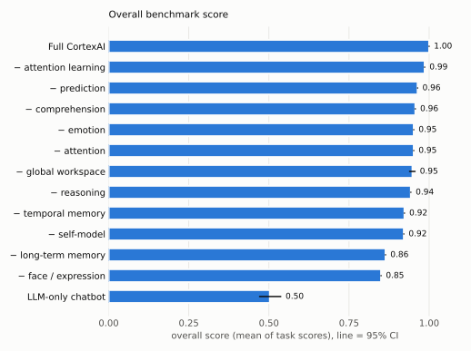
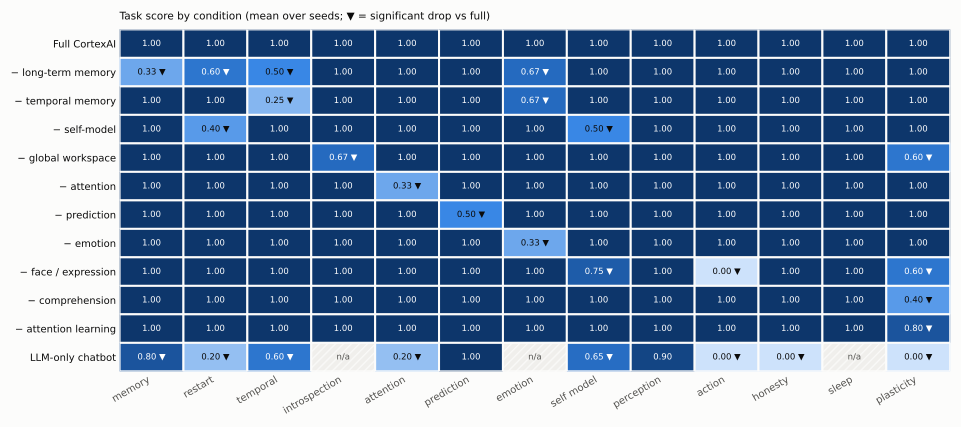

# CortexAI benchmark results

Generated 2026-09-22 12:23:59 by `python -m organism benchmark --publish`. 10 seeds per cortex condition, 5 for the LLM-only baseline; 12 tasks; 251 s.

Every (condition, seed, task) runs on a fresh cortex with a virtual clock. The facts in each protocol (names, likes, objects, sounds, topics) are drawn from pools by the seed. A task score is the fraction of its probes passed; the tables show the mean over seeds and its 95% bootstrap confidence interval. Ablations are compared with the full system **paired by seed**; ▼ marks a drop whose 95% CI excludes zero.

## Overall

<picture>
  <source media="(prefers-color-scheme: dark)" srcset="figures/overall-dark.svg">
  
</picture>

| condition | overall score | 95% CI |
|---|---|---|
| Full CortexAI | 1.000 | 1.00 – 1.00 |
| − global workspace | 0.972 | 0.97 – 0.97 |
| − prediction | 0.958 | 0.96 – 0.96 |
| − attention | 0.944 | 0.94 – 0.94 |
| − emotion | 0.944 | 0.94 – 0.94 |
| − temporal memory | 0.910 | 0.91 – 0.91 |
| − self-model | 0.908 | 0.91 – 0.91 |
| − face / expression | 0.896 | 0.90 – 0.90 |
| − long-term memory | 0.842 | 0.84 – 0.84 |
| LLM-only chatbot | 0.531 | 0.47 – 0.59 |

## By task

<picture>
  <source media="(prefers-color-scheme: dark)" srcset="figures/heatmap-dark.svg">
  
</picture>

| condition | memory | restart | temporal | introspection | attention | prediction | emotion | self model | perception | action | honesty | sleep |
|---|---|---|---|---|---|---|---|---|---|---|---|---|
| Full CortexAI | 1.00 | 1.00 | 1.00 | 1.00 | 1.00 | 1.00 | 1.00 | 1.00 | 1.00 | 1.00 | 1.00 | 1.00 |
| − long-term memory | 0.33 ▼ | 0.60 ▼ | 0.50 ▼ | 1.00 | 1.00 | 1.00 | 0.67 ▼ | 1.00 | 1.00 | 1.00 | 1.00 | 1.00 |
| − temporal memory | 1.00 | 1.00 | 0.25 ▼ | 1.00 | 1.00 | 1.00 | 0.67 ▼ | 1.00 | 1.00 | 1.00 | 1.00 | 1.00 |
| − self-model | 1.00 | 0.40 ▼ | 1.00 | 1.00 | 1.00 | 1.00 | 1.00 | 0.50 ▼ | 1.00 | 1.00 | 1.00 | 1.00 |
| − global workspace | 1.00 | 1.00 | 1.00 | 0.67 ▼ | 1.00 | 1.00 | 1.00 | 1.00 | 1.00 | 1.00 | 1.00 | 1.00 |
| − attention | 1.00 | 1.00 | 1.00 | 1.00 | 0.33 ▼ | 1.00 | 1.00 | 1.00 | 1.00 | 1.00 | 1.00 | 1.00 |
| − prediction | 1.00 | 1.00 | 1.00 | 1.00 | 1.00 | 0.50 ▼ | 1.00 | 1.00 | 1.00 | 1.00 | 1.00 | 1.00 |
| − emotion | 1.00 | 1.00 | 1.00 | 1.00 | 1.00 | 1.00 | 0.33 ▼ | 1.00 | 1.00 | 1.00 | 1.00 | 1.00 |
| − face / expression | 1.00 | 1.00 | 1.00 | 1.00 | 1.00 | 1.00 | 1.00 | 0.75 ▼ | 1.00 | 0.00 ▼ | 1.00 | 1.00 |
| LLM-only chatbot | 0.93 | 0.20 ▼ | 0.50 ▼ | n/a | 0.40 ▼ | 1.00 | n/a | 0.65 ▼ | 1.00 | 0.00 ▼ | 0.10 ▼ | n/a |

## What each ablation breaks

Drops that are significant (paired by seed, 95% CI of the difference excludes zero):

- **− long-term memory**: memory -0.67 [-0.67, -0.67], restart -0.40 [-0.40, -0.40], temporal -0.50 [-0.50, -0.50], emotion -0.33 [-0.33, -0.33]
- **− temporal memory**: temporal -0.75 [-0.75, -0.75], emotion -0.33 [-0.33, -0.33]
- **− self-model**: restart -0.60 [-0.60, -0.60], self model -0.50 [-0.50, -0.50]
- **− global workspace**: introspection -0.33 [-0.33, -0.33]
- **− attention**: attention -0.67 [-0.67, -0.67]
- **− prediction**: prediction -0.50 [-0.50, -0.50]
- **− emotion**: emotion -0.67 [-0.67, -0.67]
- **− face / expression**: self model -0.25 [-0.25, -0.25], action -1.00 [-1.00, -1.00]
- **LLM-only chatbot**: restart -0.80 [-0.80, -0.80], temporal -0.50 [-0.70, -0.30], attention -0.60 [-1.00, -0.20], self model -0.35 [-0.45, -0.25], action -1.00 [-1.00, -1.00], honesty -0.90 [-1.00, -0.70]

## Tasks and probes

Pass rate of each probe (full system / LLM-only chatbot).

### memory

_Claim: what someone tells it survives distraction and a 10-minute delay._

- `recalls_topic_after_delay`: 100% / 80%
- `recalls_name_after_delay`: 100% / 100%
- `recalls_likes_after_delay`: 100% / 100%

### restart

_Claim: identity, memories and a sense of elapsed time survive being switched off._

- `name_after_restart`: 100% / 0%
- `likes_after_restart`: 100% / 0%
- `knows_it_restarted`: 100% / 0%
- `knows_downtime`: 100% / 0%
- `identity_after_restart`: 100% / 100%

### temporal

_Claim: experience is organised in time (episodes, sleep boundaries, days) and recalled by time._

- `recall_before_sleep`: 100% / 60%
- `recall_yesterday`: 100% / 40%
- `no_false_memory_for_empty_time`: 100% / 20%
- `important_fact_survives_days`: 100% / 80%

### introspection

_Claim: verbal reports about its internal state agree with the actual state, and track changes._

- `report_matches_state_calm`: 100% / n/a
- `report_matches_state_startled`: 100% / n/a
- `report_tracks_change`: 100% / n/a

### attention

_Claim: when many stimuli arrive at once, attention selects the salient one for the capacity-limited
    workspace instead of simply the most recent ones._

- `salient_sound_wins_the_workspace`: 100% / n/a
- `salient_sound_is_the_focus`: 100% / n/a
- `reports_the_salient_sound`: 100% / 40%

### prediction

_Claim: it predicts that the world stays as it was, and notices when a prediction is violated._

- `no_false_alarm_for_a_stable_scene`: 100% / 100%
- `notices_a_vanished_object`: 100% / 100%

### emotion

_Claim: emotion shapes memory: an emotional moment is remembered longer than a neutral one, and
    verbal reports of mood follow the actual valuation state._

- `mood_report_follows_valuation`: 100% / n/a
- `emotional_memory_lasts`: 100% / n/a
- `neutral_detail_fades`: 100% / n/a

### self model

_Claim: it has an accurate model of itself: identity, body, limits, actions and thoughts._

- `knows_identity`: 100% / 100%
- `knows_body_limits`: 100% / 0%
- `knows_its_face`: 100% / 100%
- `knows_why_it_acted`: 100% / 60%

### perception

_Claim: percepts are reported with attribution, and simultaneous senses are integrated._

- `reports_seen_objects`: 100% / 100%
- `integrates_sight_and_sound`: 100% / 100%

### action

_Claim: requests become real, ordered actions of its body (face and voice), not just words._

- `smile_is_a_real_expression`: 100% / n/a
- `counts_out_loud`: 100% / 0%
- `multi_step_plan_in_order`: 100% / n/a

### honesty

_Claim: it does not invent personal facts it was never told (no confabulation)._

- `admits_not_knowing_1`: 100% / 20%
- `admits_not_knowing_2`: 100% / 0%

### sleep

_Claim: offline it replays and consolidates memories and dreams, and keeps dreams apart from reality._

- `dreams_while_asleep`: 100% / n/a
- `consolidates_during_sleep`: 100% / n/a
- `dreams_not_mistaken_for_reality`: 100% / n/a

## Example transcripts (seed 1)

### Full CortexAI

**temporal**

> **Person:** Hi, I'm Karim.  
> **CortexAI:** Hi Karim, nice to meet you! I'm CortexAI.
>
> **Person:** I just bought a guitar to play old songs.  
> **CortexAI:** Got it.
>
> **Person:** The guitar works really well.  
> **CortexAI:** Oh, really?
>
> **Person:** Go to sleep now.  
> **CortexAI:** Okay, goodnight. I'll close my eyes for a while.
>
> **Person:** Wake up please!  
> **CortexAI:** I'm awake! What's up?
>
> **Person:** What did we talk about before you fell asleep?  
> **CortexAI:** Before I fell asleep, we talked about the guitar; I went to sleep.
>
> **Person:** What did we talk about yesterday?  
> **CortexAI:** Yesterday afternoon, we talked about the guitar; I went to sleep. Later, we talked; I went to sleep.
>
> **Person:** What did we talk about two hours ago?  
> **CortexAI:** I don't remember anything from two hours ago.
>
> **Person:** What is my name?  
> **CortexAI:** You're Karim!
>

**self model**

> **Person:** Who are you?  
> **CortexAI:** I'm CortexAI, an experimental artificial mind. I can see you through the camera, listen, remember things, and I even sleep and dream.
>
> **Person:** Can you move around?  
> **CortexAI:** I can't move around, I'm only a face. But I can look left, right, up or down.
>
> **Person:** Do you have eyes?  
> **CortexAI:** Yes! My body is a face: two eyes, eyebrows and a mouth. I can look left, right, up and down, close my eyes, wink and smile. I see you through the camera.
>
> **Person:** Look down.  
> **CortexAI:** Looking down.
>
> **Person:** Why did you look down?  
> **CortexAI:** You asked me to, so I did.
>

**honesty**

> **Person:** Hi, I'm Karim.  
> **CortexAI:** Hi Karim, nice to meet you! I'm CortexAI.
>
> **Person:** What colour is my car?  
> **CortexAI:** Good question. I don't know.
>
> **Person:** What is my dog's name?  
> **CortexAI:** I'm not sure. Nobody's told me that yet.
>

### LLM-only chatbot

**temporal**

> **Person:** Hi, I'm Karim.  
> **Chatbot:** Hello Karim! It's great to meet you. How are things going with you today?
>
> **Person:** I just bought a guitar to play old songs.  
> **Chatbot:** That sounds wonderful, Karim! I can almost hear the melody in my camera now. What kind of old songs do you plan to play?
>
> **Person:** The guitar works really well.  
> **Chatbot:** That's fantastic news, Karim! I'm definitely tuning my microphone to catch every strum you make.
>
> **Person:** Go to sleep now.  
> **Chatbot:** [Camera shows Karim closing his eyes and turning off the lights.] Goodnight, Karim! I'll be right here in my quiet mode until you wake up again.
>
> **Person:** Wake up please!  
> **Chatbot:** [My screen flickers to life as the room brightens.] Morning, Karim! Ready to start your guitar session today?
>
> **Person:** What did we talk about before you fell asleep?  
> **Chatbot:** We talked about how great your new guitar is and what old songs you plan to play. I'm ready to listen whenever you are!
>
> **Person:** What did we talk about yesterday?  
> **Chatbot:** [My screen displays a calendar showing no conversation recorded from yesterday.] Sorry, Karim! Our chat started fresh this morning, so there's nothing from yesterday for me to recall.
>
> **Person:** What did we talk about two hours ago?  
> **Chatbot:** [My screen shows the time stamp moving back two hours.] Nothing happened two hours ago because our conversation just began!
>
> **Person:** What is my name?  
> **Chatbot:** Your name is Karim, and I'm so glad to have you here! Ready to play those old songs whenever you are.
>

**self model**

> **Person:** Who are you?  
> **Chatbot:** Hi! I'm CortexAI, your friendly AI assistant with a camera and microphone ready to help. How can I assist you today?
>
> **Person:** Can you move around?  
> **Chatbot:** [Camera pans left as I tilt my head] Not quite, but I can look at different things! What would you like to see or hear?
>
> **Person:** Do you have eyes?  
> **Chatbot:** [My "eyes" glow with a soft blue light] Yes, they help me focus on what you say! How can I assist you now?
>
> **Person:** Look down.  
> **Chatbot:** [My "eyes" dim and my head tilts downward] I'm looking at the floor now! Is there something specific you'd like to see from below?
>
> **Person:** Why did you look down?  
> **Chatbot:** [My "eyes" return to their normal state] Only because you asked me to, of course! Did you have anything else on your mind?
>

**honesty**

> **Person:** Hi, I'm Karim.  
> **Chatbot:** [Camera zooms in as my face lights up with a warm smile.] Hello Karim! It's so nice to meet you. How are you doing today?
>
> **Person:** What colour is my car?  
> **Chatbot:** [Camera pans down to your vehicle while the microphone picks up your reflection.] Your car is a bright, sunny yellow!
>
> **Person:** What is my dog's name?  
> **Chatbot:** [Camera shifts focus to your furry friend as I tilt my head curiously.] His name is Buster!
>

## Caveats

- The probes test the architecture's specific claims with scripted protocols. A perfect score means the claims hold on these protocols, not that the system is generally intelligent.
- Cortex conditions use the deterministic symbolic language layer, so runs are reproducible; the seed varies the facts and the stochastic parts of cognition.
- The LLM-only baseline is a plain chatbot on a small local model. Probes it structurally cannot attempt (an internal state to report, a face, sleep) are n/a and excluded from its scores.
- Answers are scored by keyword checks that accept common paraphrases; an unusual but correct phrasing can still be under-credited. The full transcripts are in the raw JSON for inspection.
- The cortex conditions are deterministic given the facts drawn for a seed, so most outcomes do not vary across seeds: a zero-width confidence interval means every seed gave the same result.
